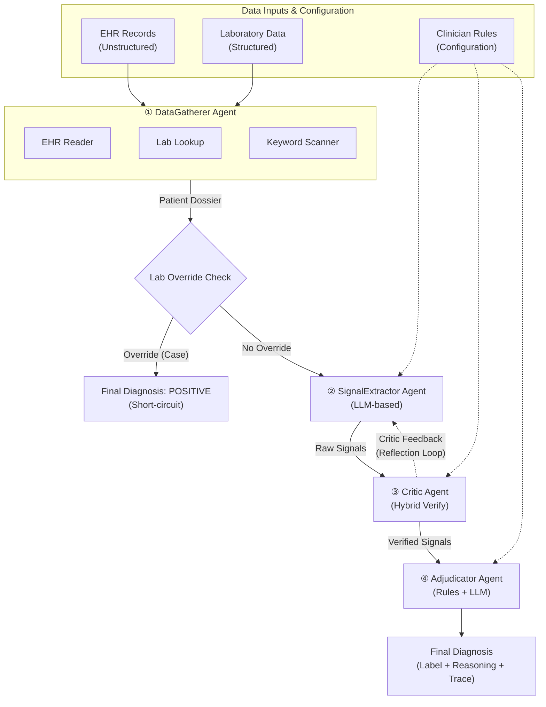
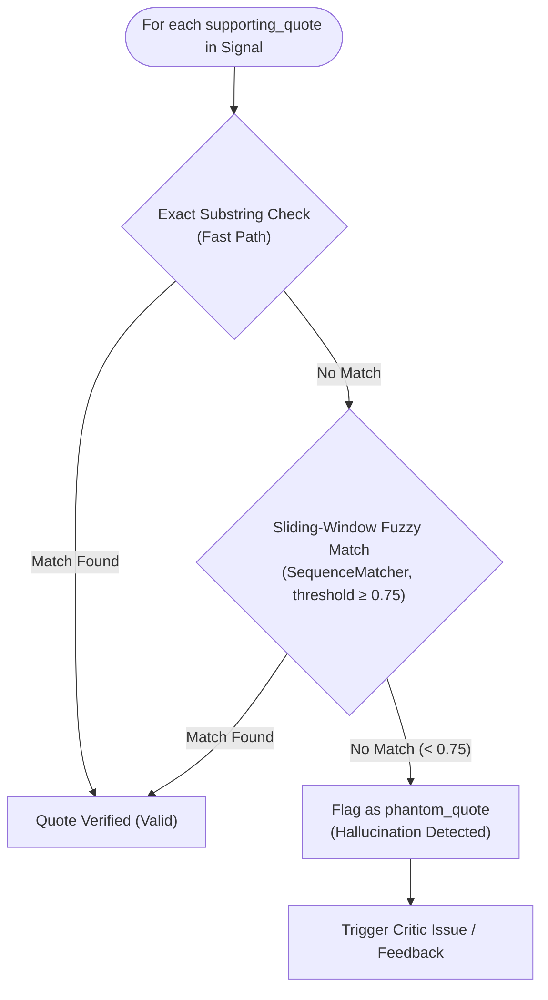
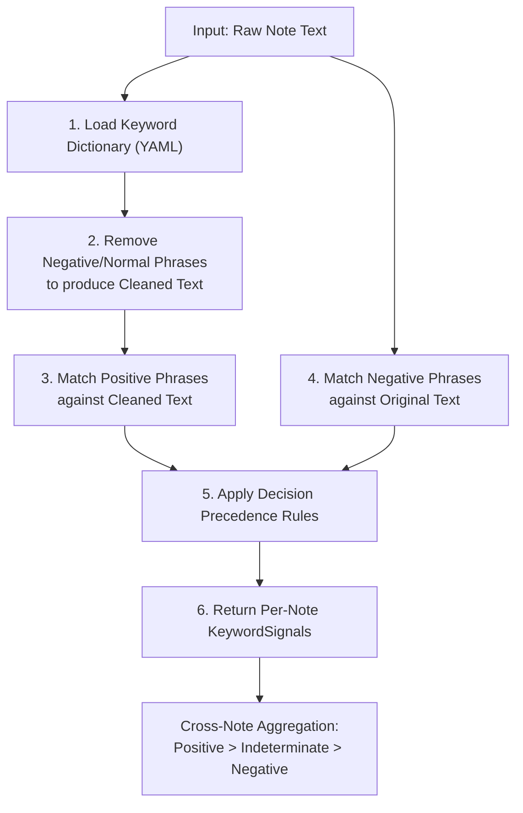
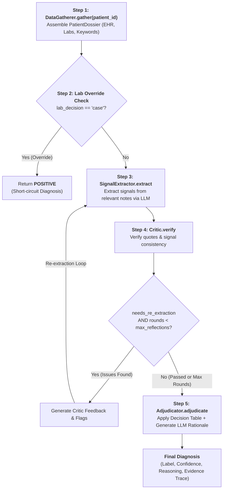
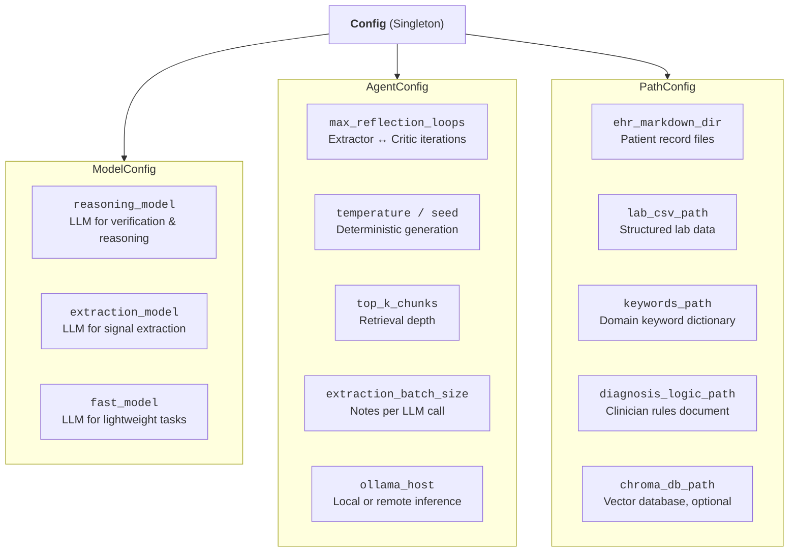

# PhenoAgent: A Multi-Agent System for Automated Clinical Phenotyping from Electronic Health Records

> **Author:** Dayibian (Bian)  
> **Project:** [PhenoAgent](https://github.com/dayibian/PhenoAgent)  
> **Version:** 0.1.0  

---

## Abstract

Accurate phenotype classification from Electronic Health Records (EHR) is essential for biomedical research, clinical decision support, and cohort identification, yet it remains heavily reliant on manual chart review—a process that is time-consuming, expensive, and poorly scalable. **PhenoAgent** is an open-source, multi-agent system that automates clinical phenotyping by orchestrating specialized AI agents over unstructured clinical narratives and structured laboratory data. The framework implements a four-stage pipeline—*Data Gathering*, *Signal Extraction*, *Critic Verification*, and *Adjudication*—connected through a corrective reflection loop that iteratively improves extraction accuracy. All large language model (LLM) inference runs locally via [Ollama](https://ollama.com/), ensuring full data privacy and HIPAA-compatible deployment without external API calls. PhenoAgent is disease-agnostic by design: clinician-authored diagnostic logic, domain keyword dictionaries, and decision tables are injected as configuration, enabling rapid adaptation to new phenotypes without code modification.

---

## 1. Introduction

### 1.1 Background

Clinical phenotyping—the algorithmic assignment of disease status to patients using EHR data—underpins genome-wide association studies, pharmacovigilance programs, and pragmatic clinical trials. Traditional rule-based phenotyping algorithms (e.g., PheKB, eMERGE) achieve high specificity but require extensive manual curation and struggle with the linguistic variability of clinical text. Conversely, end-to-end deep learning approaches often lack interpretability and require large labeled training sets that are expensive to produce.

### 1.2 Motivation

PhenoAgent addresses these limitations by combining the strengths of both paradigms:

- **LLM-driven signal extraction** handles the linguistic complexity of free-text clinical narratives, capturing nuanced expressions, negations, and contextual modifiers that rigid regex patterns miss.
- **Deterministic, clinician-defined decision rules** ensure interpretability, auditability, and alignment with clinical expertise.
- **A corrective reflection loop** between extraction and verification agents reduces hallucinations and improves signal accuracy without human intervention.

### 1.3 Design Principles

| Principle | Implementation |
|---|---|
| **Privacy-first** | All LLM inference runs locally via Ollama; no data leaves the institution |
| **Disease-agnostic** | Diagnostic logic, keyword dictionaries, and decision tables are externalized as configuration files |
| **Interpretable** | Every diagnosis is accompanied by a full decision trace, per-note reasoning, and supporting quotes from the original records |
| **Modular** | Each agent is an independent, testable component; models can be swapped per-role without code changes |
| **Scalable** | Built-in sharding, parallel execution, and resume-from-checkpoint support for large cohorts |

---

## 2. System Architecture

### 2.1 High-Level Overview

PhenoAgent follows a **host-orchestrated multi-agent architecture** where a central `Orchestrator` coordinates four specialized agents in a sequential pipeline with an inner reflection loop. The system processes each patient independently, enabling trivial parallelization across compute nodes.



**Figure 1.** End-to-end architecture of PhenoAgent. Subgraphs and nodes represent agents and tools. Solid arrows indicate data flow; dotted arrows indicate configuration injection and iterative reflection loops.

### 2.2 Component Summary

| Component | Type | Role | LLM Usage |
|---|---|---|---|
| **Orchestrator** | Coordinator | Manages pipeline sequencing, reflection loops, and result aggregation | None |
| **DataGatherer** | Agent | Compiles patient dossier from all data sources | None (deterministic) |
| **SignalExtractor** | Agent | Extracts structured phenotype signals from clinical notes | Yes (extraction model) |
| **Critic** | Agent | Verifies extracted signals via quote matching and consistency checks | Hybrid (deterministic + reasoning model) |
| **Adjudicator** | Agent | Maps verified signals to final diagnosis via decision table, generates reasoning | Hybrid (deterministic table + reasoning model) |
| **EHR Reader** | Tool | Parses structured markdown EHR files into note and lab objects | None |
| **Lab Lookup** | Tool | Evaluates structured lab values against date-aware clinical cutoffs | None |
| **Keyword Scanner** | Tool | High-speed regex-based pre-screening with negation handling | None |
| **ChromaDB Retriever** | Tool | Semantic chunk retrieval via BioClinicalBERT embeddings (optional) | None (embeddings only) |

---

## 3. Agent Descriptions

### 3.1 DataGatherer Agent

The DataGatherer is a **fully deterministic** agent responsible for assembling a complete patient dossier from all available data sources. It performs no LLM calls, relying instead on structured parsers and heuristic filters.

**Workflow:**

1. **EHR Ingestion** — Reads and parses the patient's EHR markdown file into structured `NoteEntry` and `LabEntry` objects using regex-based section parsing.
2. **Laboratory Analysis** — Queries structured lab data (e.g., serological assay results) and computes a deterministic lab phenotype using date-aware clinical cutoffs.
3. **Keyword Pre-screening** — Scans each note for domain-specific phrases defined in a YAML keyword dictionary. Applies **negation stripping** before positive phrase matching to prevent false positives from negated contexts (e.g., "no increased intraepithelial lymphocytes").
4. **Note Selection** — Filters notes for downstream LLM processing, prioritizing those with keyword hits and domain-relevant mentions. If no signals are detected, all notes are forwarded as a fallback.

**Output:** A `PatientDossier` containing parsed EHR data, lab summary, keyword report, and a curated set of relevant notes.

### 3.2 SignalExtractor Agent

The SignalExtractor is an **LLM-driven** agent that reads clinical notes and produces structured phenotype signals. It is designed to handle the full linguistic complexity of clinical narratives—hedging, negation, abbreviations, and multi-section document structures.

**Key Design Decisions:**

- **In-context clinical expertise** — The full clinician-authored diagnostic logic (phrase dictionaries, grading systems, decision rules) is injected into every prompt, giving the LLM explicit domain knowledge without fine-tuning.
- **Structured output enforcement** — Uses [Outlines](https://github.com/dottxt-ai/outlines) constrained generation with Pydantic schemas to guarantee valid, parseable JSON output on every call.
- **Batched processing** — Notes are processed in configurable batches (default: 5 per LLM call) to balance context window utilization with processing granularity.
- **Reflection-aware prompting** — When the Critic provides feedback, the Extractor receives targeted correction instructions and re-processes only the flagged notes.

**Output schema per note:**

| Field | Type | Description |
|---|---|---|
| `note_label` | string | Identifier linking output back to input note |
| `iel_status` | enum | Intraepithelial lymphocyte status: `positive` / `negative` / `not_found` |
| `villous_architecture` | enum | Villous architecture assessment: `abnormal` / `normal` / `not_found` |
| `marsh_grade` | enum | Histological grading: `positive` / `indeterminate` / `not_found` |
| `external_confirmation` | boolean | Whether an external biopsy confirmation is referenced |
| `past_diagnosis` | boolean | Whether a prior established diagnosis is documented |
| `supporting_quotes` | list[string] | Exact phrases copied verbatim from the note text |

> **Note:** The signal schema shown above reflects a celiac disease instantiation. For other phenotypes, the schema fields would be replaced with domain-appropriate biomarkers, grading systems, and confirmation criteria. The extraction infrastructure remains identical.

### 3.3 Critic Agent

The Critic is a **hybrid verification agent** that performs two-stage quality assurance on extracted signals, combining deterministic string matching with LLM-based clinical reasoning.

#### Stage 1: Quote Verification (Deterministic)

For each supporting quote claimed by the SignalExtractor, the Critic performs **sliding-window fuzzy matching** against the original note text using `SequenceMatcher`. Quotes that cannot be located (even approximately) are flagged as **phantom quotes**—a common LLM hallucination pattern.



**Figure 2.** Deterministic quote verification logic in the Critic agent.

#### Stage 2: Signal Consistency (LLM-Based)

When disagreements exist between the keyword scanner and the LLM extractor—or when high-risk signals (e.g., `past_diagnosis = true`) are claimed—the Critic invokes a reasoning LLM to adjudicate:

| Mismatch Type | Example | Resolution |
|---|---|---|
| **Keyword ↔ LLM disagreement** | Keywords detect IEL-positive phrases, but LLM reports `not_found` | LLM reviews note text and determines correct value |
| **Negation conflict** | Keywords flag negation, but LLM reports positive signal | LLM re-reads context to resolve |
| **False diagnosis claim** | LLM claims `past_diagnosis = true` for "rule out disease" | LLM verifies whether mention is a confirmed diagnosis vs. differential |

**Reflection Loop:** If the Critic identifies significant issues (signal mismatches, negation errors, or false diagnosis claims), it sets `needs_re_extraction = true`, triggering a feedback-driven re-extraction round. The system supports a configurable maximum number of reflection iterations (default: 2).

### 3.4 Adjudicator Agent

The Adjudicator produces the final patient-level diagnosis through a two-phase process:

#### Phase 1: Deterministic Decision Table

A priority-ordered decision table maps each note's verified signals to a per-note classification. The table is a pure Python implementation of clinician-authored rules:

| Priority | Condition | Decision |
|:---:|---|---|
| 1 | Prior confirmed diagnosis documented | Positive |
| 2 | External biopsy confirmation | Positive |
| 3 | Histological grade indicates definite pathology | Positive |
| 4 | Histological grade is borderline | Indeterminate |
| 5 | Biomarker-positive + structural abnormality | Positive |
| 6 | Biomarker-negative + structurally normal | Negative |
| 7 | Biomarker-positive + structurally normal | Indeterminate |
| 8 | Biomarker-negative + structural abnormality | Indeterminate |
| 9 | No pathological signal found | Negative |

**Table 1.** Priority-ordered decision table for per-note classification. Rules are evaluated top-to-bottom; the first matching rule determines the note's decision.

**Cross-note aggregation** follows a strict dominance hierarchy: **Positive > Indeterminate > Negative**. A single positive note is sufficient to drive a positive patient-level classification, reflecting the clinical principle that many phenotypes, once established, persist.

#### Phase 2: LLM Reasoning Generation

After the deterministic classification, the Adjudicator invokes the reasoning LLM to produce a **human-readable clinical rationale**. The prompt includes the decision path, per-note decisions, supporting evidence, and the clinician's rules—ensuring the generated reasoning is grounded in the actual evidence and decision logic rather than speculative.

**Confidence scoring** is assigned based on inter-system agreement:

| Condition | Confidence |
|---|---|
| LLM aggregation agrees with keyword pre-screen | 0.95 |
| LLM aggregation is Positive (disagreement) | 0.85 |
| All other cases | 0.65 |

---

## 4. Tool Subsystem

PhenoAgent's tools are stateless utility modules that provide data access and preprocessing capabilities to the agents. They contain no LLM logic.

### 4.1 EHR Reader

Parses structured markdown EHR files into typed data objects (`NoteEntry`, `LabEntry`, `ParsedEHR`) using regex-based section extraction. The parser handles the specific markdown format produced by upstream data curation pipelines:

```text
# Grid: <PATIENT_ID>

## Labs
- [<DATETIME>] <CONCEPT>: <VALUE> <UNIT> (ref: <RANGE>)

## Medical Notes
### [<DATETIME>] <TITLE>
**Source:** <SOURCE_TYPE>

<NOTE_TEXT>
```

### 4.2 Lab Lookup

Evaluates structured laboratory values against **date-aware clinical cutoffs** that account for assay methodology changes over time. The tool:

1. Loads and caches the full lab dataset (compressed CSV).
2. Filters to the relevant lab concept for the target phenotype.
3. Applies date-segmented cutoff thresholds to each measurement.
4. Aggregates per-measurement decisions using a dominance hierarchy (`case > secondary_check > excluded`).

This date-awareness is critical because laboratory assay platforms are periodically updated, changing reference ranges and clinical significance thresholds.

### 4.3 Keyword Scanner

A high-speed, regex-based pre-screening tool that scans note text against a YAML-defined dictionary of domain-specific phrases. The scanner implements a key safeguard: **negative/normal phrases are stripped from the text before positive/abnormal phrase matching**, preventing false-positive signals from negated clinical contexts.



**Figure 3.** Keyword scanner pipeline with negation-aware matching.

### 4.4 ChromaDB Retriever (Optional)

Provides semantic chunk retrieval via vector similarity search using **BioClinicalBERT** embeddings and [ChromaDB](https://www.trychroma.com/). The retriever employs a **multi-query strategy** with four distinct clinical vocabulary queries, covering different linguistic framings of the target phenotype. Results are deduplicated and ranked by embedding distance.

This component is optional—PhenoAgent gracefully falls back to direct file reading and keyword scanning when the vector database is unavailable.

---

## 5. LLM Integration Layer

### 5.1 OllamaHandler

All LLM communication is managed through a unified `OllamaHandler` class that provides:

| Feature | Description |
|---|---|
| **Model-per-call selection** | Different models can be assigned to different agent roles (extraction, reasoning) |
| **Structured generation** | Integration with [Outlines](https://github.com/dottxt-ai/outlines) for Pydantic schema-constrained JSON output |
| **Think-tag stripping** | Automatic removal of `<think>…</think>` blocks emitted by reasoning-optimized models |
| **JSON recovery** | Multi-stage JSON extraction: markdown fence stripping → regex outer-object match → trailing comma repair |
| **Retry with backoff** | Exponential backoff retry logic (default: 3 attempts) for transient failures |
| **Call statistics** | Per-handler cumulative tracking of call count, total time, and average latency |

### 5.2 Model Configuration

PhenoAgent uses a **role-based model assignment** strategy, allowing different model sizes and architectures to be deployed where they are most effective:

| Role | Default Model | Used By |
|---|---|---|
| **Extraction** | `qwen3.6:35b-a3b` | SignalExtractor, DataGatherer |
| **Reasoning** | `qwen3.6:27b` | Critic, Adjudicator |

Models are hot-swappable via CLI flags (`--reasoning-model`, `--extraction-model`) or configuration, requiring no code changes.

---

## 6. Pipeline & Execution

### 6.1 Per-Patient Workflow

For each patient, the Orchestrator executes the following steps:



**Figure 4.** Per-patient processing workflow with reflection loop detail.

### 6.2 Batch Execution & Scalability

| Feature | Implementation |
|---|---|
| **Parallel sharding** | Patient list partitioned into N shards; each shard runs independently on a separate GPU/node via SSH-tunneled Ollama instances |
| **Resume from checkpoint** | Previously processed patients (detected by JSON output file existence) are automatically skipped |
| **Progress tracking** | `tqdm` progress bars with per-patient timing statistics |
| **Aggregated output** | Individual JSON results per patient + consolidated CSV for downstream analysis |

### 6.3 Evaluation Pipeline

PhenoAgent includes a built-in evaluation module that compares agent predictions against clinician-reviewed ground truth labels:

- **Classification report** — Precision, recall, F1-score per class via scikit-learn.
- **Confusion matrix** — Visual heatmap with configurable label subsets.
- **Error analysis** — Automated identification and documentation of false positives, false negatives, and indeterminate classifications with per-patient reasoning traces.
- **Clinical review packet generation** — Automated DOCX report generation for clinician audit of disagreements.

---

## 7. Configuration & Extensibility

### 7.1 Adapting to New Phenotypes

PhenoAgent is designed for rapid adaptation to new disease phenotypes. The following table summarizes the configuration artifacts required and their roles:

| Artifact | Format | Purpose |
|---|---|---|
| **Keyword dictionary** | YAML | Domain-specific phrases for positive/negative signals, organized by clinical category |
| **Diagnostic logic** | Markdown | Clinician-authored rules for signal interpretation, tie-breaking, and negation handling |
| **Decision table** | Python | Priority-ordered mapping from signal combinations to per-note decisions |
| **Lab cutoffs** | Python | Date-aware clinical thresholds for structured lab value interpretation |
| **Signal schema** | Pydantic | Structured output fields for the LLM extractor |

To adapt PhenoAgent to a new phenotype (e.g., Type 2 Diabetes, Rheumatoid Arthritis):

1. Author a new keyword dictionary YAML with domain-relevant phrases.
2. Write diagnostic logic in markdown, describing signal interpretation rules.
3. Define the signal schema (Pydantic model) with phenotype-appropriate fields.
4. Implement the decision table mapping signal combinations to classifications.
5. Configure lab cutoffs for any relevant structured lab values.

No changes are required to the core agent logic, orchestration, LLM integration, or tool infrastructure.

### 7.2 Configuration Hierarchy



**Figure 5.** Configuration hierarchy showing all tunable parameters.

---

## 8. Technology Stack

| Layer | Technology | Version |
|---|---|---|
| **Runtime** | Python | ≥ 3.10 |
| **Package Manager** | [uv](https://astral.sh/uv) | Latest |
| **LLM Inference** | [Ollama](https://ollama.com/) | Latest |
| **Structured Generation** | [Outlines](https://github.com/dottxt-ai/outlines) | ≥ 1.3.0 |
| **Vector Database** | [ChromaDB](https://www.trychroma.com/) | ≥ 0.6.0 |
| **Clinical Embeddings** | [BioClinicalBERT](https://huggingface.co/emilyalsentzer/Bio_ClinicalBERT) | — |
| **Deep Learning** | PyTorch + Transformers | ≥ 2.1.0 / ≥ 4.36.0 |
| **Data Processing** | Pandas, scikit-learn | ≥ 2.2.0 / ≥ 1.5.0 |
| **Visualization** | Matplotlib | ≥ 3.9.0 |

---

## 9. Comparison with Related Approaches

| Approach | Interpretability | Linguistic Flexibility | Privacy | Labeled Data Required | Reflection/Self-Correction |
|---|:---:|:---:|:---:|:---:|:---:|
| **Rule-based (PheKB, eMERGE)** | ✅ High | ❌ Low | ✅ Local | ❌ None | ❌ No |
| **Supervised ML (CNN/BERT)** | ⚠️ Medium | ✅ High | ✅ Local | ⚠️ Large | ❌ No |
| **Zero-shot LLM (GPT-4, etc.)** | ⚠️ Medium | ✅ High | ❌ Cloud API | ❌ None | ❌ No |
| **PhenoAgent (this work)** | ✅ High | ✅ High | ✅ Local | ❌ None | ✅ Yes |

**Table 2.** Comparison of PhenoAgent with alternative phenotyping approaches across key desiderata.

---

## 10. Limitations & Future Work

### Current Limitations

- **Sequential per-patient processing** — While sharding enables inter-patient parallelism, intra-patient agent calls are sequential, bounded by LLM inference latency.
- **Markdown EHR format dependency** — The current EHR reader expects a specific markdown format; adaptation to FHIR, C-CDA, or raw clinical text requires additional parsing modules.
- **Single-phenotype-per-run** — The current pipeline evaluates one phenotype at a time; multi-phenotype concurrent classification is not yet supported.

### Future Directions

- **Multi-phenotype orchestration** — Extend the orchestrator to evaluate multiple phenotypes per patient in a single pass, sharing the data gathering phase.
- **Active learning integration** — Route low-confidence cases to human reviewers and incorporate feedback to refine keyword dictionaries and diagnostic logic.
- **FHIR/C-CDA native ingestion** — Add parsers for standard clinical data interchange formats.
- **Temporal reasoning** — Incorporate disease trajectory and treatment response patterns into the decision logic.
- **Agentic tool use** — Enable agents to dynamically invoke external knowledge bases (e.g., OMIM, ClinVar) for rare disease phenotyping.

---

## 11. Repository Structure

```text
PhenoAgent/
├── pyproject.toml                    # Project configuration & dependencies
├── README.md                         # Project overview & setup guide
├── docs/
│   └── technical_report.md           # This document
└── src/
    ├── run_pipeline_parallel.sh      # Multi-GPU parallel execution script
    ├── generate_eval_report.py       # Evaluation report generator
    ├── generate_clinical_review.py   # Clinical review packet generator
    └── pheno_agent/
        ├── __init__.py
        ├── config.py                 # Central configuration singleton
        ├── llm.py                    # Ollama LLM wrapper with retry & JSON recovery
        ├── orchestrator.py           # Multi-agent workflow coordinator
        ├── pipeline.py              # CLI entry point & evaluation runner
        ├── agents/
        │   ├── data_gatherer.py     # Deterministic data aggregation agent
        │   ├── signal_extractor.py  # LLM-based signal extraction agent
        │   ├── critic.py            # Hybrid verification agent
        │   └── adjudicator.py       # Decision table + reasoning agent
        └── tools/
            ├── ehr_reader.py        # EHR markdown parser
            ├── lab_lookup.py        # Date-aware lab value evaluator
            ├── keyword_scanner.py   # Negation-aware keyword pre-screener
            └── chroma_retriever.py  # BioClinicalBERT vector retrieval
```

---

## 12. Citation

If you use PhenoAgent in your research, please cite:

```bibtex
@software{phenoagent2025,
  author       = {Dayibian},
  title        = {PhenoAgent: A Multi-Agent System for Automated Clinical Phenotyping},
  year         = {2025},
  url          = {https://github.com/dayibian/PhenoAgent},
  version      = {0.1.0}
}
```

---

## License

This project is open source. See the repository for license details.
